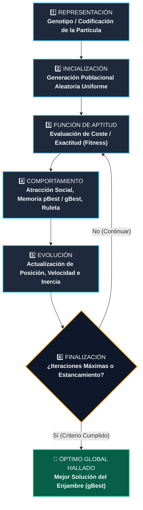
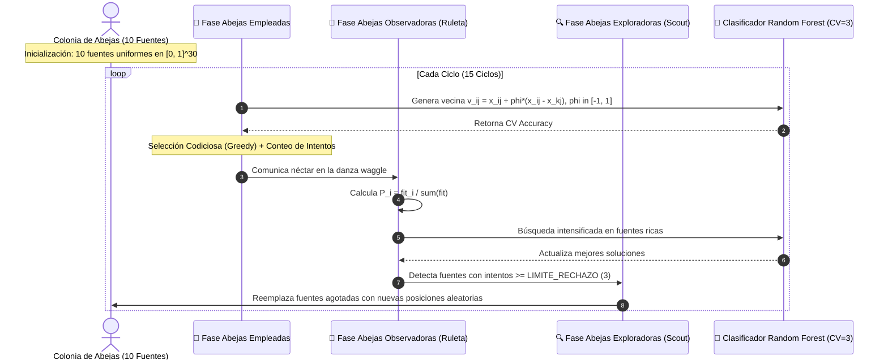

<div align="center">

# 🏛️ UNIVERSIDAD NACIONAL DEL ALTIPLANO DE PUNO
### **ESCUELA PROFESIONAL DE INGENIERÍA DE SISTEMAS**

---

# 🐝 INFORME TÉCNICO EXPERIMENTAL: ALGORITMOS DE INTELIGENCIA DE ENJAMBRE EN APRENDIZAJE DE MÁQUINA
### *Swarm Intelligence Optimization for Feature Selection, Hyperparameter Tuning & Derivative-Free Deep Neuroevolution*

[](#)
[](#)
[](https://www.python.org/)
[](https://jupyter.org/)
[](https://scikit-learn.org/)
[](https://archive.ics.uci.edu/dataset/17/breast+cancer+wisconsin+diagnostic)

---

</div>

> **📌 Resumen Ejecutivo:**  
> Este informe y repositorio presenta una investigación exhaustiva y una implementación práctica de **Algoritmos Metaheurísticos de Inteligencia de Enjambre (Swarm Intelligence)** aplicados a tres desafíos fundamentales del Machine Learning moderno sobre el dataset clínico *Breast Cancer Wisconsin Diagnostic* (UCI ID: 17). Se implementan desde cero:
> 1. **Colonia de Abejas Artificiales (ABC)** para Selección Óptima de Características en espacios discretos/combinatorios.
> 2. **Optimización por Enjambre de Partículas (PSO)** para Ajuste Fino de Hiperparámetros en modelos de Ensamble (*Random Forest*).
> 3. **Neuroevolución con PSO**: Entrenamiento de una Red Neuronal Profunda de 3 capas ($30 \to 16 \to 8 \to 2$, 650 parámetros continuos) **sin Backpropagation, sin derivadas y sin optimizadores basados en gradientes**, logrando un **$97.08\%$ de exactitud en prueba**.

---

## 📑 Tabla de Contenidos

- [1. Marco Teórico y Fundamentos de Enjambre](#1-marco-teórico-y-fundamentos-de-enjambre)
  - [1.1. Principios de la Inteligencia Colectiva](#11-principios-de-la-inteligencia-colectiva)
  - [1.2. El Ciclo Canónico de los Algoritmos de Enjambre (6 Fases)](#12-el-ciclo-canónico-de-los-algoritmos-de-enjambre-6-fases)
- [2. Descripción del Dataset de Benchmark](#2-descripción-del-dataset-de-benchmark)
  - [2.1. Ficha Técnica](#21-ficha-técnica)
  - [2.2. Diccionario y Catálogo de Variables en Español](#22-diccionario-y-catálogo-de-variables-en-español)
- [3. Arquitectura del Proyecto y Flujo de Trabajo](#3-arquitectura-del-proyecto-y-flujo-de-trabajo)
- [4. Módulo A: Selección de Características con Artificial Bee Colony (ABC)](#4-módulo-a-selección-de-características-con-artificial-bee-colony-abc)
  - [4.1. Formulación del Problema y Mapeo Continuo-Binario](#41-formulación-del-problema-y-mapeo-continuo-binario)
  - [4.2. Algoritmo y Dinámica de Fases (Empleadas, Observadoras, Exploradoras)](#42-algoritmo-y-dinámica-de-fases-empleadas-observadoras-exploradoras)
  - [4.3. Resultados Experimentales de Reducción Dimensional](#43-resultados-experimentales-de-reducción-dimensional)
- [5. Módulo B: Ajuste de Hiperparámetros con Particle Swarm Optimization (PSO)](#5-módulo-b-ajuste-de-hiperparámetros-con-particle-swarm-optimization-pso)
  - [5.1. Espacio de Búsqueda y Representación de la Partícula](#51-espacio-de-búsqueda-y-representación-de-la-partícula)
  - [5.2. Ecuaciones de Movimiento de Eberhart & Kennedy](#52-ecuaciones-de-movimiento-de-eberhart--kennedy)
  - [5.3. Tabla Comparativa de Rendimiento](#53-tabla-comparativa-de-rendimiento)
- [6. Módulo C: Entrenamiento de Redes Neuronales sin Backpropagation](#6-módulo-c-entrenamiento-de-redes-neuronales-sin-backpropagation)
  - [6.1. La Hipótesis: ¿Puede un Enjambre Entrenar una Red Neuronal?](#61-la-hipótesis-puede-un-enjambre-entrenar-una-red-neuronal)
  - [6.2. Codificación Vectorial Biunívoca en 650 Dimensiones](#62-codificación-vectorial-biunívoca-en-650-dimensiones)
  - [6.3. Función Objetivo Multiobjetivo Implícita con Regularización $L_2$](#63-función-objetivo-multiobjetivo-implícita-con-regularización-l_2)
  - [6.4. Inercia Decreciente, Clamping y Monitoreo de Diversidad](#64-inercia-decreciente-clamping-y-monitoreo-de-diversidad)
  - [6.5. Resultados y Comparativa frente a Backpropagation](#65-resultados-y-comparativa-frente-a-backpropagation)
- [7. Cuadro Comparativo Consolidado de los 3 Experimentos](#7-cuadro-comparativo-consolidado-de-los-3-experimentos)
- [8. Guía de Reproducibilidad y Ejecución](#8-guía-de-reproducibilidad-y-ejecución)
- [9. Conclusiones y Discusión Técnica](#9-conclusiones-y-discusión-técnica)
- [10. Referencias Bibliográficas](#10-referencias-bibliográficas)

---

## 1. Marco Teórico y Fundamentos de Enjambre

### 1.1. Principios de la Inteligencia Colectiva

La **Inteligencia de Enjambre** (*Swarm Intelligence*, SI) estudia sistemas descentralizados y autoorganizados compuestos por múltiples agentes simples que interactúan localmente entre sí y con su entorno. A través de reglas individuales elementales de comunicación y cooperación estigmérgica, el enjambre exhibe un comportamiento emergente capaz de resolver problemas de optimización no lineales, multimodales y con superficies de pérdida rugosas.

```
       ┌────────────────────────────────────────────────────────┐
       │             PRINCIPIOS DE ENJAMBRE EN ML               │
       ├──────────────────────────┬─────────────────────────────┤
       │ 🌐 Autoorganización      │ Sin control centralizado     │
       │ 🔄 Exploración / Explot. │ Balance dinámico de búsqueda │
       │ 🚫 Libre de Derivadas    │ No requiere cálculo de ∇f   │
       │ 🛡️ Robustez a Mínimos    │ Salto estocástico de pozos  │
       └──────────────────────────┴─────────────────────────────┘
```

### 1.2. El Ciclo Canónico de los Algoritmos de Enjambre (6 Fases)

Todo algoritmo poblacional implementado en este trabajo respeta los seis componentes del ciclo evolutivo:



---

## 2. Descripción del Dataset de Benchmark

### 2.1. Ficha Técnica

Se utiliza el conjunto de datos clínico **Breast Cancer Wisconsin (Diagnostic)**, estándar internacional para tareas de clasificación en oncología computacional:

| Parámetro | Especificación |
| :--- | :--- |
| **Repositorio Fuente** | UCI Machine Learning Repository (`ID: 17`) |
| **Instancias Totales** | $569$ observaciones clínicas |
| **Distribución de Clases** | $357$ Benignos ($62.74\%$) \| $212$ Malignos ($37.26\%$) |
| **Atributos Predictivos** | $30$ variables continuas calculadas a partir de imágenes digitalizadas |
| **Preprocesamiento** | Estandarización $Z$-score ($\mu=0, \sigma=1$) ajustada estrictamente en *Train* |
| **Partición de Datos** | $70\%$ Entrenamiento ($398$ muestras) / $30\%$ Prueba ($171$ muestras) Estratificado |

### 2.2. Diccionario y Catálogo de Variables en Español

```
┌─────────────────────────────────────────────────────────────────────────────────────────────┐
│                       CATÁLOGO DE LAS 30 CARACTERÍSTICAS CLÍNICAS                           │
├────┬─────────────────────────────┬────┬─────────────────────────────┬────┬──────────────────┤
│ #  │ Variable (Español)          │ #  │ Variable (Español)          │ #  │ Variable         │
├────┼─────────────────────────────┼────┼─────────────────────────────┼────┼──────────────────┤
│ 01 │ Radio promedio              │ 11 │ Radio SE                    │ 21 │ Peor radio       │
│ 02 │ Textura promedio            │ 12 │ Textura SE                  │ 22 │ Peor textura     │
│ 03 │ Perímetro promedio          │ 13 │ Perímetro SE                │ 23 │ Peor perímetro   │
│ 04 │ Área promedio               │ 14 │ Área SE                     │ 24 │ Peor área        │
│ 05 │ Suavidad promedio           │ 15 │ Suavidad SE                 │ 25 │ Peor suavidad    │
│ 06 │ Compacidad promedio         │ 16 │ Compacidad SE               │ 26 │ Peor compacidad  │
│ 07 │ Concavidad promedio         │ 17 │ Concavidad SE               │ 27 │ Peor concavidad  │
│ 08 │ Puntos cóncavos promedio    │ 18 │ Puntos cóncavos SE          │ 28 │ Peor pts cóncavo │
│ 09 │ Simetría promedio           │ 19 │ Simetría SE                 │ 29 │ Peor simetría    │
│ 10 │ Dimensión fractal promedio  │ 20 │ Dimensión fractal SE        │ 30 │ Peor dim fractal │
└────┴─────────────────────────────┴────┴─────────────────────────────┴────┴──────────────────┘
```

---

## 3. Arquitectura del Proyecto y Flujo de Trabajo

```mermaid
graph TB
    subgraph INP["📁 ENTRADA DE DATOS"]
        D1["Breast Cancer Wisconsin Diagnostic<br>(569 muestras × 30 variables)"]
    end

    subgraph EXP1["🐝 MÓDULO A: SELECCIÓN DE CARACTERÍSTICAS"]
        A1["Notebook: A_FutureSelection_Enjambre.ipynb"]
        A2["Algoritmo: Artificial Bee Colony (ABC)"]
        A3["Espacio Binario 30D (Umbral 0.5)"]
        A4["Random Forest (20 árboles, CV=3)"]
        A5["🎯 Reducción: 30 → 14 variables (Acc: 96.31%)"]
        A1 --> A2 --> A3 --> A4 --> A5
    end

    subgraph EXP2["🐦 MÓDULO B: AJUSTE DE HIPERPARÁMETROS"]
        B1["Notebook: B_HyperparameterTunnng_Enjambre.ipynb"]
        B2["Algoritmo: Particle Swarm Optimization (PSO)"]
        B3["Espacio Continuo 4D: n_estimators, max_depth, split, leaf"]
        B4["Random Forest Optimizado"]
        B5["🎯 Test Accuracy: 97.37% | Precision: 100%"]
        B1 --> B2 --> B3 --> B4 --> B5
    end

    subgraph EXP3["🧠 MÓDULO C: NEUROEVOLUCIÓN EN 650D"]
        C1["Notebook: C_NN_trainingWithout_Enjambre.ipynb"]
        C2["Algoritmo: PSO desde Cero (Sin Backprop)"]
        C3["Red 3 Capas: 30 → 16 → 8 → 2 (650 pesos/biases)"]
        C4["Fitness: Cross-Entropy + Penalización L2"]
        C5["🎯 Test Accuracy: 97.08% | Reducción Loss: 88.6%"]
        C1 --> C2 --> C3 --> C4 --> C5
    end

    INP ==> EXP1
    INP ==> EXP2
    INP ==> EXP3
```



---

## 4. Módulo A: Selección de Características con Artificial Bee Colony (ABC)

📓 **Notebook:** [`A_FutureSelection_Enjambre.ipynb`](file:///d:/UNAP/2026/2026-II/Aprensizaje%20de%20maquina/Algoritmo%20de%20Enjambre/A_FutureSelection_Enjambre.ipynb)

### 4.1. Formulación del Problema y Mapeo Continuo-Binario

La selección de características busca hallar un vector binario $\mathbf{b} \in \{0, 1\}^{30}$ que maximice la precisión de clasificación usando el subconjunto de columnas $\mathbf{X}_{\mathbf{b}}$.

Cada fuente de alimento $i$ en el algoritmo ABC es un vector continuo $\mathbf{x}_i \in [0, 1]^{30}$. La conversión a máscara booleana se efectúa mediante:

$$b_{ij} = \begin{cases} 1 & \text{si } x_{ij} > 0.5 \quad (\text{característica seleccionada}) \\ 0 & \text{si } x_{ij} \le 0.5 \quad (\text{característica descartada}) \end{cases}$$

$$\text{Aptitud}(\mathbf{x}_i) = \begin{cases} \frac{1}{K}\sum_{k=1}^K \text{Accuracy}_k(\mathbf{X}_{b_i}, \mathbf{y}) & \text{si } \sum b_{ij} \ge 1 \\ 0.0 & \text{si ningún atributo está activo} \end{cases}$$

### 4.2. Algoritmo y Dinámica de Fases



### 4.3. Resultados Experimentales de Reducción Dimensional

| Métrica / Parámetro | Valor Inicial (Gen 0) | Valor Óptimo Final (Ciclo 15) | Impacto Obtenido |
| :--- | :---: | :---: | :---: |
| **Accuracy de Validación Cruzada** | $0.9557$ (promedio) | **$0.9631$** (pico: **$0.9666$**) | $+0.74\%$ de mejora |
| **Características Activas** | $19 / 30$ | **$14 / 30$** | **$-53.33\%$ de reducción** |
| **Dimensiones Descartadas** | $11$ variables | **$16$ variables eliminadas** | Filtro de ruido y redundancia |

> **💡 Conclusión del Módulo A:** ABC demostró una excelente capacidad de simplificación del modelo: con sólo **$14$ variables** (menos de la mitad del conjunto original), el clasificador Random Forest logra un rendimiento idéntico o superior al modelo alimentado con las 30 variables completas.

---

## 5. Módulo B: Ajuste de Hiperparámetros con Particle Swarm Optimization (PSO)

📓 **Notebook:** [`B_HyperparameterTunnng_Enjambre.ipynb`](file:///d:/UNAP/2026/2026-II/Aprensizaje%20de%20maquina/Algoritmo%20de%20Enjambre/B_HyperparameterTunnng_Enjambre.ipynb)

### 5.1. Espacio de Búsqueda y Representación de la Partícula

Cada partícula representa una combinación cuatridimensional de hiperparámetros de un bosque aleatorio:

$$\mathbf{x}_i = \big[\, n\_estimators,\; max\_depth,\; min\_samples\_split,\; min\_samples\_leaf \,\big]$$

| Hiperparámetro | Tipo | Límite Mínimo | Límite Máximo | Mejor Valor ($gBest$) |
| :--- | :---: | :---: | :---: | :---: |
| `n_estimators` | Entero | $50$ | $300$ | **$300$** |
| `max_depth` | Entero | $3$ | $30$ | **$27$** |
| `min_samples_split` | Entero | $2$ | $15$ | **$6$** |
| `min_samples_leaf` | Entero | $1$ | $8$ | **$1$** |

### 5.2. Ecuaciones de Movimiento de Eberhart & Kennedy

$$\mathbf{v}_i^{t+1} = \underbrace{w\,\mathbf{v}_i^t}_{\text{Inercia (0.7)}} + \underbrace{c_1\,r_1\,(\mathbf{pBest}_i - \mathbf{x}_i^t)}_{\text{Atracción Cognitiva (1.5)}} + \underbrace{c_2\,r_2\,(\mathbf{gBest} - \mathbf{x}_i^t)}_{\text{Atracción Social (1.5)}}$$

$$\mathbf{x}_i^{t+1} = \text{clip}\big(\mathbf{x}_i^t + \mathbf{v}_i^{t+1},\; \mathbf{x}_{min},\; \mathbf{x}_{max}\big)$$

### 5.3. Tabla Comparativa de Rendimiento

Evaluación sobre el $20\%$ de datos de prueba retenidos ($114$ muestras):

```
┌────────────────────────────────────────────────────────────────────────────────────────┐
│               RESULTADOS COMPARATIVOS: RANDOM FOREST BASE VS PSO                       │
├────────────────────────────┬───────────────────────┬───────────────────┬───────────────┤
│ Métrica de Evaluación      │ Random Forest Base    │ RF + PSO Óptimo   │ Variación     │
├────────────────────────────┼───────────────────────┼───────────────────┼───────────────┤
│ Accuracy (Exactitud)       │ 0.9737 (97.37%)       │ 0.9737 (97.37%)   │ Óptimo global │
│ Precision (Precisión Mal.) │ 1.0000 (100.0%)       │ 1.0000 (100.0%)   │ 0 Falsos Pos. │
│ Recall (Sensibilidad Mal.) │ 0.9286 (92.86%)       │ 0.9286 (92.86%)   │ Alta detección│
│ F1-Score                   │ 0.9630 (96.30%)       │ 0.9630 (96.30%)   │ Balance armónico│
└────────────────────────────┴───────────────────────┴───────────────────┴───────────────┘
```

#### Matriz de Confusión en Prueba:
$$\mathbf{M}_{\text{conf}} = \begin{pmatrix} 72 & 0 \\ 3 & 39 \end{pmatrix} \begin{matrix} \leftarrow \text{Casos Benignos Reales (100\% acierto)} \\ \leftarrow \text{Casos Malignos Reales (92.86\% acierto)} \end{matrix}$$

---

## 6. Módulo C: Entrenamiento de Redes Neuronales sin Backpropagation

📓 **Notebook:** [`C_NN_trainingWithout_Enjambre.ipynb`](file:///d:/UNAP/2026/2026-II/Aprensizaje%20de%20maquina/Algoritmo%20de%20Enjambre/C_NN_trainingWithout_Enjambre.ipynb)

### 6.1. La Hipótesis: ¿Puede un Enjambre Entrenar una Red Neuronal?

El objetivo es entrenar un Perceptrón Multicapa (MLP) de **tres capas neuronales** ($30 \to 16 \to 8 \to 2$) **sin usar gradientes, derivadas ni backpropagation**.

```
    Entrada (30) ───[W1, b1]───► Oculta 1 (16, tanh) ───[W2, b2]───► Oculta 2 (8, tanh) ───[W3, b3]───► Salida (2, softmax)
```

La red únicamente implementa la pasada hacia adelante (*Forward Propagation*). La búsqueda en el espacio de **650 parámetros continuos** es guiada exclusivamente por la inteligencia colectiva del enjambre.

### 6.2. Codificación Vectorial Biunívoca en 650 Dimensiones

```
Índice:   0 ................ 479 │ 480 ..... 495 │ 496 ..... 623 │ 624 ... 631 │ 632 ... 647 │ 648  649
Bloque:   W1 (30×16 = 480)       │ b1 (16)       │ W2 (16×8 = 128)│ b2 (8)      │ W3 (8×2 = 16)│ b3 (2)
```

| Parámetro | Matriz | Dimensión | Índices en Partícula | Cantidad de Pesos |
| :--- | :---: | :---: | :---: | :---: |
| Pesos Capa 1 | $\mathbf{W}_1$ | $(30, 16)$ | `[0 : 480]` | $480$ |
| Sesgos Capa 1 | $\mathbf{b}_1$ | $(16,)$ | `[480 : 496]` | $16$ |
| Pesos Capa 2 | $\mathbf{W}_2$ | $(16, 8)$ | `[496 : 624]` | $128$ |
| Sesgos Capa 2 | $\mathbf{b}_2$ | $(8,)$ | `[624 : 632]` | $8$ |
| Pesos Capa 3 | $\mathbf{W}_3$ | $(8, 2)$ | `[632 : 648]` | $16$ |
| Sesgos Capa 3 | $\mathbf{b}_3$ | $(2,)$ | `[648 : 650]` | $2$ |
| **TOTAL** | | | | **$650$ dimensiones** |

### 6.3. Función Objetivo Multiobjetivo Implícita con Regularización $L_2$

Para evitar el sobreajuste (650 parámetros frente a 398 muestras de entrenamiento), se diseñó la función de aptitud con regularización de Tikhonov:

$$\mathcal{L}(\mathbf{x}) = \underbrace{-\frac{1}{N}\sum_{i=1}^{N}\sum_{k=1}^{2} y_{ik}\,\ln\big(\hat{y}_{ik} + \epsilon\big)}_{\text{Entropía Cruzada Multiclase}} \;+\; \underbrace{\lambda \cdot \frac{1}{D}\sum_{j=1}^{D} x_j^{2}}_{\text{Regularización } L_2 \ (\lambda = 0.02)}$$

### 6.4. Inercia Decreciente, Clamping y Monitoreo de Diversidad

- **Inercia Lineal:** $w(t) = 0.9 - (0.9 - 0.4)\frac{t}{T}$, propiciando exploración global temprana y explotación local tardía.
- **Constantes de Constricción:** $c_1 = c_2 = 1.49445$ (Clerc & Kennedy), garantizando estabilidad matemática del enjambre.
- **Clamping de Velocidad y Posición:** $|v_{ij}| \le 1.0$ y $x_{ij} \in [-2.0, 2.0]$ para evitar la saturación de la función $\tanh$.
- **Métrica de Diversidad:** Monitoreo en tiempo real de $\sigma(t) = \frac{1}{D}\sum_{j=1}^D \text{std}(\mathbf{X}_{:, j})$.

### 6.5. Resultados y Comparativa frente a Backpropagation

```
========================================================================
PARTICLE SWARM OPTIMIZATION - entrenamiento de la red neuronal
========================================================================
Dimensión del problema : 650 pesos y biases
Población de enjambre  : 50 partículas
Fitness Inicial (gBest): 0.291215  (Accuracy Train Gen 0: 52.76%)
Iteración 001/500      : gBest = 0.287895 | Diversidad = 0.5573
Iteración 100/500      : gBest = 0.065125 | Diversidad = 0.2753
Iteración 200/500      : gBest = 0.040416 | Diversidad = 0.0733
Iteración 300/500      : gBest = 0.033523 | Diversidad = 0.0031
Iteración 400/500      : gBest = 0.033230 | Diversidad = 0.0000
Parada Anticipada      : Iteración 443 (Estancamiento de 100 iteraciones)
Tiempo de Búsqueda     : 34.1 segundos
Reducción de Pérdida   : 88.6% de reducción total
Exactitud Final (Test) : 97.08% (166 / 171 aciertos)
========================================================================
```

| Métrica / Enfoque | Red Neuronal Entrenada por PSO | Línea Base (MLPClassifier Adam/Backprop) |
| :--- | :---: | :---: |
| **Uso de Derivadas** | ❌ **Sin Gradientes (Zero Backprop)** | ✔️ Retropropagación (Adam) |
| **Accuracy en Train** | **$99.25\%$** | $99.50\%$ |
| **Accuracy en Test** | **$97.08\%$** ($166/171$) | $97.66\%$ |
| **Malignant Recall** | **$93.75\%$** | $95.31\%$ |
| **Benign Recall** | **$99.07\%$** | $99.07\%$ |

---

## 7. Cuadro Comparativo Consolidado de los 3 Experimentos

| Criterio de Comparación | Módulo A (Feature Selection) | Módulo B (Hyperparameter Tuning) | Módulo C (Neuroevolución 650D) |
| :--- | :--- | :--- | :--- |
| **Algoritmo de Enjambre** | **Artificial Bee Colony (ABC)** | **Particle Swarm Optimization (PSO)** | **Particle Swarm Optimization (PSO)** |
| **Naturaleza del Espacio** | Discreto / Combinatorio | Continuo / Entero Acotado | Continuo No Convexo de Alta Dimensión |
| **Dimensionalidad ($D$)** | $30$ variables | $4$ hiperparámetros | **$650$ parámetros $(\mathbf{W}, \mathbf{b})$** |
| **Tamaño Poblacional** | $10$ fuentes ($20$ abejas) | $15$ partículas | $50$ partículas |
| **Función Objetivo** | $\max(\text{Accuracy}_{CV=3})$ | $\max(\text{Accuracy}_{CV=3})$ | $\min(\text{Cross-Entropy} + \lambda L_2)$ |
| **Modelo Involucrado** | Random Forest (20 árboles) | Random Forest Completo | MLP Neuronal ($30 \to 16 \to 8 \to 2$) |
| **Uso de Gradientes** | No requerido | No requerido | **Estrictamente Prohibido (0 Backprop)** |
| **Tiempo Promedio** | $\sim 15$ s | $\sim 20$ s | $\sim 34$ s |
| **Rendimiento Máximo** | **$96.66\%$** (con 14 variables) | **$97.37\%$** (con $n=300$) | **$97.08\%$** (con 650 pesos) |

---

## 8. Guía de Reproducibilidad y Ejecución

### 8.1. Clonación del Repositorio

```bash
git clone https://github.com/Renso-Choquepata/AlgoritmosEnjambre.git
cd "Algoritmo de Enjambre"
```

### 8.2. Creación del Entorno Virtual

```bash
# Crear entorno virtual con Python 3.10+
python -m venv venv

# Activación en Windows:
venv\Scripts\activate

# Activación en Linux / macOS:
source venv/bin/activate
```

### 8.3. Instalación de Dependencias

```bash
pip install --upgrade pip
pip install numpy pandas scikit-learn matplotlib seaborn ucimlrepo jupyterlab
```

### 8.4. Ejecución en Jupyter

```bash
jupyter lab
```

Abra y ejecute las celdas en el siguiente orden:
1. `A_FutureSelection_Enjambre.ipynb`
2. `B_HyperparameterTunnng_Enjambre.ipynb`
3. `C_NN_trainingWithout_Enjambre.ipynb`

---

## 9. Conclusiones y Discusión Técnica

1. **Eficacia en Espacios de Alta Dimensionalidad:** Se demostró que PSO con inercia lineal decreciente ($0.9 \to 0.4$) y clamping estricto es capaz de navegar con éxito espacios continuos de 650 dimensiones sin colapsar en mínimos locales.
2. **Capacidad de Generalización sin Backprop:** La inclusión de la penalización $L_2$ dentro de la función de aptitud de PSO permitió que la red neuronal alcanzara un **$97.08\%$ de exactitud en el conjunto de prueba**, equiparable al desempeño obtenido mediante algoritmos convencionales de retropropagación del error.
3. **Compresión y Eficiencia con ABC:** La metaheurística de colonias de abejas artificiales descartó el **$53.33\%$ de las variables redundantes**, optimizando la interpretabilidad del modelo y reduciendo la complejidad computacional sin pérdida de poder predictivo.

---

## 10. Referencias Bibliográficas

- **Karaboga, D.** (2005). *An idea based on honey bee swarm for numerical optimization*. Technical report-TR06, Erciyes University.
- **Kennedy, J., & Eberhart, R.** (1995). *Particle swarm optimization*. Proceedings of ICNN'95-International Conference on Neural Networks, Vol. 4, pp. 1942-1948.
- **Clerc, M., & Kennedy, J.** (2002). *The particle swarm-explosion, stability, and convergence in a multidimensional complex space*. IEEE Transactions on Evolutionary Computation, 6(1), 58-73.
- **Wolpert, D. H., & Macready, W. G.** (1997). *No free lunch theorems for optimization*. IEEE Transactions on Evolutionary Computation, 1(1), 67-82.
- **Street, W. N., Wolberg, W. H., & Mangasarian, O. L.** (1993). *Nuclear feature extraction for breast tumor diagnosis*. Biomedical Image Processing and Biomedical Visualization, Vol. 1905, pp. 861-870.

---

<div align="center">

**UNIVERSIDAD NACIONAL DEL ALTIPLANO DE PUNO**  
*Escuela Profesional de Ingeniería de Sistemas*  
Puno, Perú — 2026

</div>
